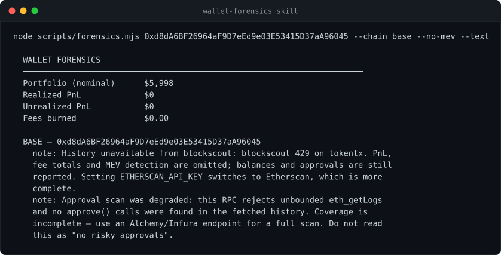

# wallet-forensics skill

[](https://github.com/daronthedragon/wallet-forensics-skill/actions/workflows/ci.yml)

An agent skill for forensic analysis of blockchain wallets. Give an agent an address, get back what it actually holds, what it lost, and what still puts it at risk.

Works on **Ethereum, Base, Arbitrum, Optimism, Polygon, and Solana**. Zero dependencies and no API keys required — Node 20+ and nothing else.

## What it reports

| | |
|---|---|
| **Exit liquidity** | What a position would *actually* sell for, route-quoted through Uniswap V3 and Jupiter — versus what a portfolio tracker claims |
| **Realized & unrealized PnL** | Weighted-average cost basis reconstructed from history |
| **Approval risk** | Outstanding allowances on EVM, token-account delegates on Solana, scored by what could be taken right now |
| **MEV extraction** | Sandwich attacks against the wallet's swaps, with confidence levels |
| **Fee archaeology** | Lifetime fees, what they cost then, what that currency is worth now, and how much went to reverted transactions |
| **Ranked regrets** | Everything above, sorted by dollar cost |

## The point

Every portfolio tracker computes `balance × spot price` and calls it your net worth. For anything outside the top few hundred tokens that number is fiction — spot price comes from the last trade, which may have been $40 against a pool holding $3,000.

This skill route-quotes the real sale and reports the gap:

```
Portfolio (nominal)      $84,210
Portfolio (realizable)   $31,447    62.7% evaporates on exit
```

_Those two figures are illustrative — they show what the gap looks like, not a specific wallet. A real captured run is below._

## What a keyless run actually looks like

No API keys, no install, public infrastructure throttling everything it can:

<p align="center">
  
</p>

<details>
<summary>Same output as text</summary>

```
node scripts/forensics.mjs 0xd8dA6BF26964aF9D7eEd9e03E53415D37aA96045 --chain base --no-mev --text

  WALLET FORENSICS
  ──────────────────────────────────────────────────────────────────────
  Portfolio (nominal)      $5,998
  Realized PnL             $0
  Unrealized PnL           $0
  Fees burned              $0.00

  BASE — 0xd8dA6BF26964aF9D7eEd9e03E53415D37aA96045
    note: History unavailable from blockscout: blockscout 429 on tokentx. PnL,
    fee totals and MEV detection are omitted; balances and approvals are still
    reported. Setting ETHERSCAN_API_KEY switches to Etherscan, which is more
    complete.
    note: Approval scan was degraded: this RPC rejects unbounded eth_getLogs
    and no approve() calls were found in the fetched history. Coverage is
    incomplete — use an Alchemy/Infura endpoint for a full scan. Do not read
    this as "no risky approvals".
```

</details>

Every zero carries the reason it is a zero. The report never says "no risky approvals" when what happened was "the approval scan was refused" — those are different claims, and conflating them is how a security tool gets someone hurt.

## Install

Drop the folder into your agent's skills directory:

```bash
git clone https://github.com/daronthedragon/wallet-forensics-skill ~/.claude/skills/wallet-forensics
```

The agent picks it up from `SKILL.md`. No build, no `npm install`.

## Use it directly

The script works fine as a standalone CLI:

```bash
node scripts/forensics.mjs 0xd8dA6BF26964aF9D7eEd9e03E53415D37aA96045 --text
```

```bash
node scripts/forensics.mjs 0xd8dA... --all-evm --json > report.json
```

| Flag | Effect |
|---|---|
| `--chain <list>` | `ethereum,base,arbitrum,optimism,polygon,solana` |
| `--all-evm` | Every supported EVM chain |
| `--text` | Human-readable summary instead of JSON |
| `--max <n>` | Cap transactions fetched (default 2000) |
| `--since <date>` | Only activity from this date |
| `--no-liquidity` | Skip routing quotes |
| `--no-mev` | Skip sandwich detection |

## Configuration

Everything has a working public default. Two variables meaningfully improve results:

| Variable | Needed for | Notes |
|---|---|---|
| `ETHERSCAN_API_KEY` | EVM history → PnL, fees, MEV | **Optional.** Without it, history comes from Blockscout — no key, full history on most chains. With it, Etherscan is more complete and more reliable; one key covers every EVM chain (V2 API is unified), free tier is enough. |
| `SOLANA_RPC_URL` | Anything Solana | The public endpoint is heavily rate limited and will 429 on active wallets. Helius/Triton/QuickNode recommended. |
| `COINGECKO_API_KEY` | Faster pricing | Optional. |

## Layout

```
SKILL.md                              trigger description + agent instructions
scripts/forensics.mjs                 the analyzer — zero dependencies
references/methodology.md             how each number is produced, and where it breaks
references/interpreting-results.md    turning a report into a useful explanation
```

`SKILL.md` stays short on purpose. The references load only when a question actually calls for them.

## Design notes

**Zero dependencies** is the constraint that makes this usable as a skill rather than a project. Everything goes over Node's built-in `fetch`.

The one cost is ABI encoding. Function selectors are Keccak-256 hashes, and Node's `crypto` ships NIST SHA-3 — a different algorithm producing different output. Selectors are therefore hardcoded alongside their signatures. They are permanent constants of the ERC-20 and Uniswap interfaces, so this is safe.

**Every stage degrades independently.** If approval scanning fails because the RPC rejects unbounded log queries, you still get PnL, fees, and liquidity — plus a warning saying exactly what is missing and why.

The warnings are specific about *which* number they undermine, because a vague one is worse than none. A failed token sweep after a successful native balance reports that the portfolio total is a floor rather than claiming balances are simply unavailable. History truncated by `--max` reports that wallet age and lifetime fees are floors too. The skill instructs the agent to read these before presenting any figure as complete, and never to treat a degraded approval scan as a clean bill of health.

## Limitations

Stated plainly, because a forensics tool that oversells itself is worse than none:

- **Cost basis is inferred, not authoritative.** Trades with no stablecoin or native leg are excluded from PnL rather than guessed at. Not tax-ready.
- **Base's Blockscout instance is unreliable** on `txlist`. Without an Etherscan key, history on Base may be unavailable; the other four EVM chains work keyless.
- **Exit liquidity checks Uniswap V3 and Jupiter only.** A token with liquidity elsewhere reads as illiquid. "No route found" means *this tool found no route*.
- **MEV detection finds sandwiches on EVM chains only**, not JIT liquidity, backrun-only extraction, or cross-domain MEV. Solana sandwich detection is not implemented here — the TypeScript implementation has it.
- **Sandwich detection needs a capable RPC.** It reads full blocks, which public endpoints often refuse. When blocks cannot be read the report says so explicitly, because zero sandwiches found and zero sandwiches checked are very different claims.
- **CEX depth is invisible.** A token can be perfectly sellable on Binance and look dead on-chain.

## Related

The full TypeScript implementation, with a test suite and HTML report output, lives at [wallet-forensics](https://github.com/daronthedragon/wallet-forensics). This repo is the agent-facing skill: same methodology, no dependencies, packaged for an agent to invoke.

## License

MIT
